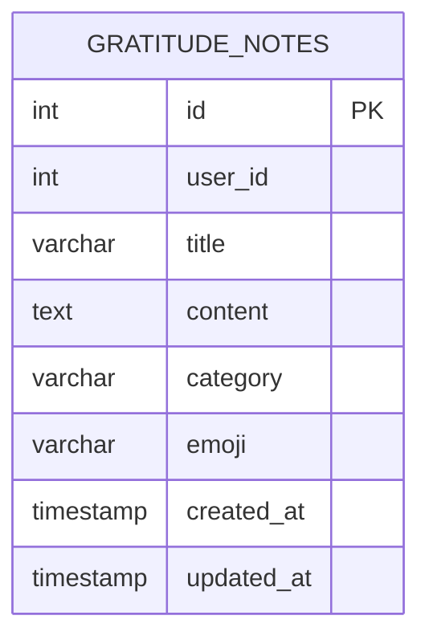

# Database Schema Documentation

## Gratitude Jar Database Structure

The Gratitude Jar application uses a PostgreSQL database with a single table to store gratitude notes. Below is the visual representation of the database schema:



## Table Details

### gratitude_notes

| Column Name | Data Type | Constraints | Description |
|------------|-----------|-------------|-------------|
| id | SERIAL | PRIMARY KEY | Auto-incrementing unique identifier |
| user_id | INTEGER | NOT NULL | Identifier for the user who created the note |
| title | VARCHAR(255) | NOT NULL | Title of the gratitude note |
| content | TEXT | NOT NULL | Main content of the gratitude note |
| category | VARCHAR(50) | NULL | Category of the note (optional) |
| emoji | VARCHAR(10) | NOT NULL | Emoji representing the note's mood |
| created_at | TIMESTAMP WITH TIME ZONE | NOT NULL | When the note was created |
| updated_at | TIMESTAMP WITH TIME ZONE | NOT NULL | When the note was last updated |

## SQL Migration

The table is created using the following SQL migration:

```sql
CREATE TABLE IF NOT EXISTS gratitude_notes (
    id SERIAL PRIMARY KEY,
    user_id INTEGER NOT NULL,
    title VARCHAR(255) NOT NULL,
    content TEXT NOT NULL,
    category VARCHAR(50),
    emoji VARCHAR(10) NOT NULL,
    created_at TIMESTAMP WITH TIME ZONE NOT NULL,
    updated_at TIMESTAMP WITH TIME ZONE NOT NULL
);
```

## Relationships

- The `gratitude_notes` table is a standalone table with no foreign key relationships
- Each note is uniquely identified by its `id` field
- The `user_id` field is used to associate notes with users (currently using a default value)
- The `created_at` and `updated_at` fields are automatically managed by the application